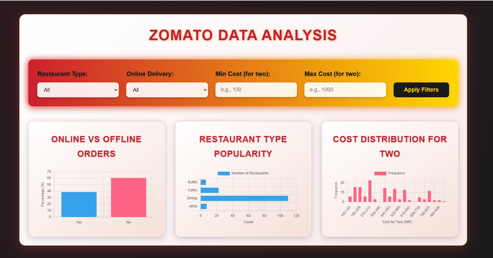

# Zomato Data Analysis Dashboard

> A sophisticated, interactive dashboard for exploring Zomato restaurant trends with dynamic filters, powered by Python and styled with a luxurious red-gold cinematic design.

---

## Overview
"""
Project Goal: Dive into Zomato restaurant data to reveal insights on cuisine popularity, online delivery trends, and cost distribution for two people.
Key Features:
  - Python-driven data cleaning and statistical analysis
  - Interactive web dashboard with real-time filters
  - Stunning red-gold gradient design with cinematic animations
  - Filters: Restaurant type, online delivery, custom cost range
"""

## Requirements
- **Runtime**: Python 3.8+
- **Dependencies**:
  pandas
  numpy
  matplotlib
  seaborn
- **Dataset**: Download 'zomato.csv' from:
  > https://www.geeksforgeeks.org/zomato-data-analysis-using-python/
  > or Kaggle Zomato datasets

## Installation
1. Clone the repository:
   $ git clone https://github.com/siddu925/zomato-analysis.git
   $ cd zomato-analysis
2. Install dependencies:
   $ pip install -r requirements.txt
3. Add dataset:
   > Place 'zomato.csv' in 'data/' directory
4. Add screenshot (if not present):
   > Ensure 'screenshots/dashboard-screenshot.png' is in the repo
   $ git add screenshots/dashboard-screenshot.png
   $ git commit -m "Add dashboard screenshot"
   $ git push origin main

## Usage
1. Run the analysis:
   $ python main.py
   > Outputs:
   > - Cleaned data: 'data/cleaned_zomato.csv'
   > - Statistics: 'output/results/'
   > - Static charts: 'output/figures/'
   > - Web data: 'static/data/zomato_data.json'
2. Launch the dashboard:
   > Open 'templates/index.html' in a browser (e.g., Chrome, Firefox)
   > Interact:
   > - Select restaurant type: e.g., 'Dining', 'Cafes'
   > - Choose delivery: 'Yes', 'No', 'All'
   > - Set cost range: e.g., min 100, max 1000
   > - Click 'Apply Filters' to update charts
3. Explore outputs:
   > Static charts: 'output/figures/'
   > Stats: 'output/results/'

## Tech Stack
- **Backend**:
  > Python: Pandas, NumPy, Matplotlib, Seaborn
- **Frontend**:
  > HTML, JavaScript, Chart.js
- **Design**:
  > Custom CSS: Lora/Montserrat fonts, red-gold gradients, cinematic animations

## Screenshots
### Dashboard Interface

> Interactive dashboard showing online vs offline orders, restaurant type popularity, and cost distribution with filters.
> Note: If the image doesn't display, ensure 'screenshots/dashboard-screenshot.png' is in the repo and the path is correct.

## Contributing
1. Fork this repository
2. Create a branch: $ git checkout -b feat/your-feature
3. Commit changes: $ git commit -m "Add your feature"
4. Push to branch: $ git push origin feat/your-feature
5. Submit a pull request

## License
> MIT License: Free to use, modify, and share

## Credits
- **Data Source**: Inspired by GeeksforGeeks Zomato Analysis
  > https://www.geeksforgeeks.org/zomato-data-analysis-using-python/
- **Tools**:
  > Chart.js for charts
  > Google Fonts: Lora, Montserrat for typography

## Contact
- **GitHub**: https://github.com/siddu925
- **Email**: siddeshgm268@gmail.com

## Future Enhancements
- Add more filters (e.g., ratings, location)
- Implement a backend server for faster filtering
- Expand visualizations with additional metrics

## Troubleshooting
- **Image Not Visible**:
  > - Verify 'screenshots/dashboard-screenshot.png' exists in the repo
  > - Check file name case sensitivity (e.g., .png vs .PNG)
  > - Use raw URL if needed: https://github.com/siddu925/zomato-analysis/raw/main/screenshots/dashboard-screenshot.png
  > - Ensure you're on the correct branch (e.g., main)
